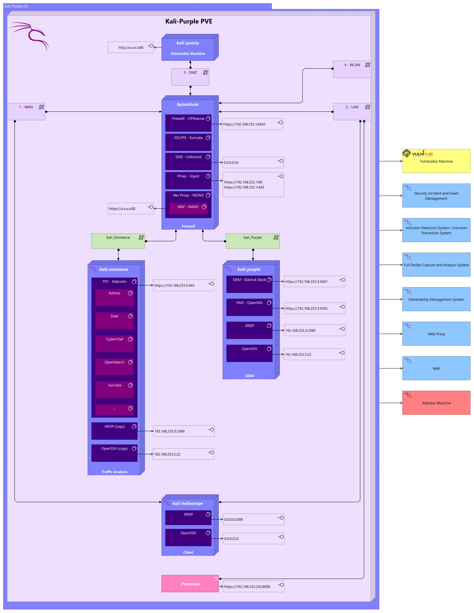

# Kali-Purple

## The ultimate SOC in a box

## Overview:

### Feeling Red? Feeling Blue?

### Kali Purple: You Do You!

- Practice Ops: Virtualization, firewalls, VLAN, WAF, SIEM, IDS/IPS, ...
- Practice Red: Penetration testing of vulnerable machines while seeing what the blue team sees. Can you become stealthier?
- Practice Blue: Firewall and IPS rules, SIEM analysis and dashboard development, ...
- Purple teaming: Red and Blue working together to develop the ultimate set of rules
- Protect: Deploy Kali-Purple to protect your network

### Architecture

## Installation

tbd

## Usage

  
  
  
  
  

## Roadmap

Q1 2023:     Elastic installer package,  Kali-Purple installer  
Q2 2023:     Custom Kibana dashboards  
Q3 2023 ff.: The community decides the roadmap  

## Contributing

Kali-Purple is a community project.  
We appreciate all and any contribution to make Kali-Purple the most comprehensive SOC-in-a-box solution and lab environment in the world.  
